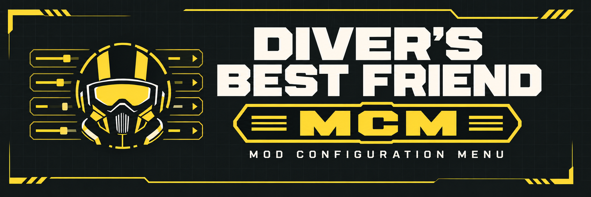

# DBF-MCM

**Diver's Best Friend — Mod Configuration Menu**, preview **0.1.51**.
An in-game settings framework for Helldivers 2, with mouse and keyboard navigation, per-mod pages and persistent settings.

[Downloads](https://github.com/HWG90/DBF-MCM/releases) | [Installation](docs/INSTALL-STANDALONE.md) | [Creator API](docs/API.md) | [Example](examples/example.lua) | [Credits](docs/CREDITS.md)

## Installation

Choose one package and loading route. Run one MCM instance and one startup/shared loader.

| Package | Loader | Installation |
| --- | --- | --- |
| `DBF-MCM-LLL-0.1.51.zip` | [Live Lua Loader](https://github.com/HWG90/LLL) | Extract the complete `dbf_mcm` folder into `%LOCALAPPDATA%/LLL/Helldivers2/Mods`. |
| `ModConfigurationMenu-Preview-0.1.51.zip` | LLL or MDL API 2 | Install the complete `dbf_mcm` folder in the selected loader's Mods directory. |
| `DBF-MCM-Standalone-0.1.51.zip` | [Bingus Shared Loader](https://github.com/CowboyBingus/BingusSharedLoader/releases), v15+ / API 1 | Import into Arsenal, enable alongside Shared Loader, deploy, then restart. |

LLL and Standalone do not require MDL. Bingus Mod Options Menu is optional. Disable the previous MCM provider before switching routes; LLL also scans other supported loader folders. Keep `mod.lua`, `library.txt` and the named native DLL together for loose installations. Native library updates require a normal game restart.

## Controls and features

Press **F10** to open or close; **Escape** closes the menu or cancels the active editor. Mouse clicks select controls, and the wheel scrolls the area under the pointer. Tab changes focus; arrows navigate or change values; Enter selects; Home restores a control's default; Page Up/Down change sections. Drag the title bar to move the window or its edges/corners to resize it. The menu does not pause gameplay.

Supported controls include toggles, sliders with numeric entry, dropdown choices, key bindings, text input, color pickers, actions, sections and text. Pages support nested categories, two columns, descriptions, disabled controls, confirmation and defaults. Mods can register or unregister during the session. Compatibility registrations cover existing Mod Options Menu consumers; compatibility with every third-party mod is not established.

When the game loses focus, the menu retains its navigation state and releases input/cursor capture. On return it revalidates focus and suppresses held external inputs. Close, disable, shutdown and error recovery restore input ownership.

Framework settings use `%LOCALAPPDATA%/MDL/Helldivers2/Mods/dbf_mcm/settings`, including when MDL is absent, to retain existing values. Mods can supply their own storage provider. Linked presentation controls share an authoritative registered setting rather than saving duplicate values. Optional HUD previews require the separately installed HUD assets.

## For mod authors

Use `_G.DBFMCM` API 1 and stable mod/control IDs. Start with the [API](docs/API.md), [example](examples/example.lua) and [integration guide](docs/INTEGRATION.md). Saved scalar values are data and are never executed; failed saves leave values and callbacks unchanged.

Build the loose packages with `build.ps1 -Python <non-Store Python executable>`; run `build_standalone.py` with that interpreter for the Shared Loader archive. Both use the existing native helper in `native/build`; rebuild it with `native/build.py` after native source changes. `tests/run.py` runs isolated LuaJIT contracts. Building never installs the mod.

## Validation limits

Preview 0.1.51 preserves the current focus/capture, resizing, legacy grouping, linked controls and per-mod storage changes. Offline tests and package checks do not establish live loading or input behavior for every route. All 42 broad contracts and 11 focused suites pass after correcting stale confirmation and mouse-position fixtures; see [release validation](docs/RELEASE-0.1.51.md). Controller navigation and native pause-menu integration are not provided. Intermittent dropdown text loss remains under investigation.
