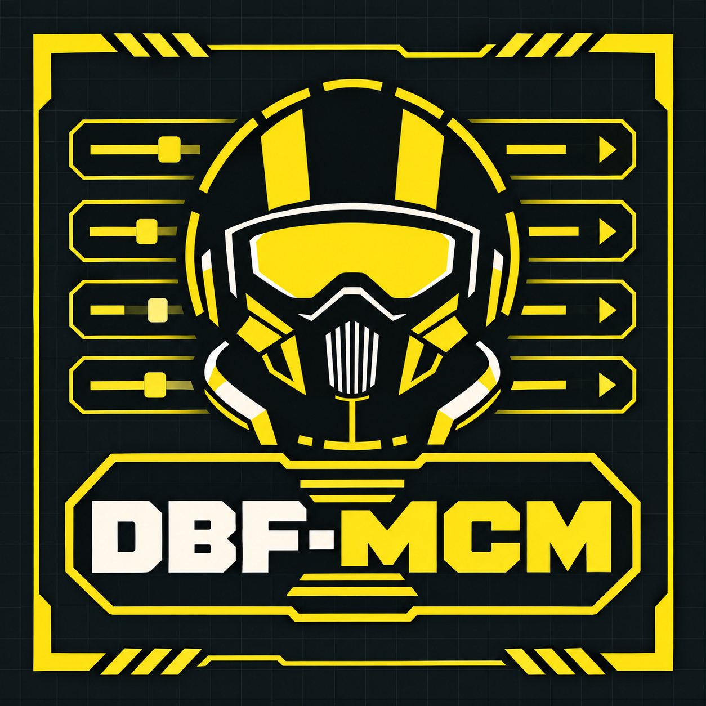

# DBF-MCM

Current preview: **0.1.50**. See the [new versioned prerelease](https://github.com/HWG90/DBF-MCM/releases/tag/mcm-v0.1.50-preview.1).

**Diver's Best Friend — Mod Configuration Menu**

A reusable in-game configuration framework for Helldivers 2 mod creators.

[Downloads](https://github.com/HWG90/DBF-MCM/releases) | [Installation](docs/INSTALL-STANDALONE.md) | [Creator API](docs/API.md) | [Example menu](examples/example.lua) | [Report an issue](https://github.com/HWG90/DBF-MCM/issues)

**Choose one loading path:** [Live Lua Loader (LLL)](https://github.com/HWG90/LLL) with the loose Preview package, Bingus Shared Loader with the Standalone package, or MDL API 2 with the loose Preview package. Run only one MCM instance and one startup/shared loader. Bingus Mod Options Menu is optional.

The standalone variant is newly packaged and still requires live installation validation. See [Standalone installation](docs/INSTALL-STANDALONE.md).

An independent Helldivers 2 configuration framework inspired by the original Skyrim/SkyUI and Fallout 4 MCM. Public prerelease builds are available; remaining live-test limitations are documented.

The UI has a scrolling mod list on the left, subpages below it, one or two columns of settings on the right, and contextual help and control hints below. Mod registrations are not truncated to eight. It uses stock Stingray GUI/font resources and uses either an optional MDL adapter or a Shared Loader startup adapter. The startup adapter chains the game update and shutdown callbacks.

## Current delivery

This is a first executable preview, **not a finished MCM equivalent**. The registry, saved values, keyboard navigation and rendering lifecycle have isolated contract tests. Native drawing, mouse coordinates and key response still require an in-game check. A built-in control showcase provides that check; it changes only its own example settings.

Implemented: toggle, slider, choice, key binding capture, action button, section, text; named pages; optional two-column placement; descriptions; disabled controls; default restoration; per-mod persisted values; callback isolation; late registration and unregister/reload lifecycle; mouse click selection and keyboard navigation.

Not yet implemented: native Escape-menu entry, controller navigation, dynamic visibility conditions, dependency/version messaging, JSON menu loading, localization, whole-page defaults, and full compatibility with every native ModOptionsMenu consumer. Existing mods register through a compatibility adapter; their original mod packages remain installed.

## Use with Live Lua Loader (LLL)

MCM can also be loaded by [Live Lua Loader](https://github.com/HWG90/LLL). Follow LLL's [R18 migration and lifecycle guide](https://github.com/HWG90/LLL/blob/main/docs/MOD-MIGRATION.md) and use the **ModConfigurationMenu-Preview** ZIP, not the Standalone archive. Extract its `dbf_mcm` folder into `%LOCALAPPDATA%/LLL/Helldivers2/Mods` with `mod.lua`, `library.txt` and the named native DLL together. MDL is not required for LLL's supported context adapter.

Disable/remove the previous MCM startup provider before switching; do not keep a second enabled MCM copy in a scanned MDL/Bingus folder. LLL can reload Lua, but native DLL changes need a normal restart and compiled game assets still need mod-manager deployment. MCM's own values retain their existing Local AppData settings path. See [installation details](docs/INSTALL-STANDALONE.md) for requirements and validation limits. This path is supported by the published adapter and existing session loading; a clean install of the exact 0.1.49/LLL R18 combination remains unverified.

## Install with Bingus Shared Loader

1. Install [Bingus Shared Loader](https://github.com/CowboyBingus/BingusSharedLoader/releases) following its instructions.
2. Download the **DBF-MCM Standalone** ZIP from [MCM prereleases](https://github.com/HWG90/DBF-MCM/releases).
3. Close the game, import the ZIP into [Arsenal](https://www.nexusmods.com/helldivers2/mods/4664), enable it with Shared Loader, and deploy.
4. Disable any existing MCM instance in MDL. Bingus Mod Options can also be disabled. Run only one MCM instance.
5. Restart the game and press F10. Restart once after switching option providers so other mods can register.

The Standalone archive contains no MDL startup mod and does not require MDL. It cannot disable a previously installed MDL instance automatically. The separate MDL ZIP is an optional developer/live-reload alternative.

Mouse selects settings; wheel scrolls lists, Tab changes focus, arrows navigate, Enter selects, and F10 or Escape closes. Action confirmations use Apply. Preset filenames commit when you click away. The menu does not pause gameplay.

See [Standalone installation and validation](docs/INSTALL-STANDALONE.md). Third-party registrations survive MCM reload in the verified Shallow Water Diving test; compatibility with every mod is not established. Intermittent missing dropdown text remains under investigation.

## For mod authors

Start with [API documentation](docs/API.md) and the [working example](examples/example.lua). Read the [MCM reference and roadmap](docs/MCM-REFERENCE.md) for the intended finished structure.

Definitions and saved values are separate. Settings live under `%LOCALAPPDATA%/MDL/Helldivers2/Mods/dbf_mcm/settings/<mod-id>.ini`; files contain plain scalar values and are never executed. Failed disk writes do not commit the new setting or fire callbacks. Keep IDs stable across releases.

Read [input capture details and limitations](docs/INPUT-CAPTURE.md). Build: `python native/build.py`, then `python build.py`. Verify: `python tests/run.py`. The distributable ZIP contains the standalone MDL mod, documentation, and author example. No private testing payloads are included. Packaging does not establish public licensing, release readiness, or live-game validation.

## Bingus compatibility

Bingus Mod Options Menu is optional. When it is absent, MCM provides its API for toggle, choice and slider registrations, values and change callbacks. Compatibility registrations persist across MCM reloads; Shallow Water Diving was verified live to remain available after reload. If the original menu is enabled, MCM can import its registry instead. Bingus Shared Loader is a separate prerequisite and remains required.

Compatibility with every third-party mod is not yet verified. Original-menu saved values are not automatically migrated, and dynamic translation parity remains unverified. Intermittent dropdown text loss is under investigation.

Mouse wheel: hover the settings area to scroll three rows per notch; hover the left mod list to move through mods. Wheel scrolling leaves setting values unchanged. Raw mouse wheel packets are consumed by the native helper while capture is active.

Scrollbars indicate position in long mod lists, subpage lists and settings pages. Settings also show the current row range. Scrollbar thumbs are position indicators; use the wheel or keyboard to scroll.

Drag the title bar to reposition the menu. Its position survives closing/reopening within this framework session and is clamped to screen bounds, including after resolution changes.

Choice controls open dropdown lists. Scroll the wheel inside an open dropdown, use Up/Down or Page Up/Down, then Enter or click to select. Escape or clicking outside cancels. Long lists have a position scrollbar with click-to-jump support.

Click a slider value box to type a number. The first character replaces the old value; Ctrl+A selects it, Backspace/Delete remove text. Enter validates the range and configured step before committing; Escape or clicking elsewhere cancels. Confirmation pages keep valid edits pending.

## Project branding

  

[Compact logo](assets/branding/logo.png) | [Wide banner](assets/branding/banner.png) | [Branding guide](assets/branding/BRANDING.md)
[Preview 0.1.50 source checkpoint and validation limits](docs/PREVIEW-CHECKPOINT.md) describes mapped HUD preview roles, retained material updates and cleanup tests.

